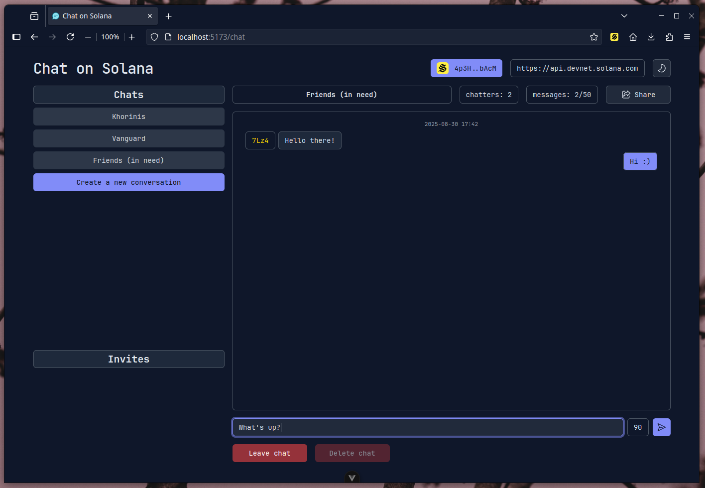

# Chat on Solana

A fullstack application for instant messaging using blockchain and crypto-wallets.

## Features

- Serverless
- State fully stored on Solana blockchain
- Up to 4 chatters per conversation
- Rotating buffer of 50 messages
- Invitation system
- Only fee payment for sending messages
- Funds recovery (not including fees) by deleting conversations
- Solflare crypto-wallet support
- Self-hosted frontend

## Showcase

<details>
<summary>(Click to expand)</summary>

### Welcome page

Brief explanation and step-by-step instructions on how to join.


### Invitation system

Send invites to other registered on Solana wallets. Choose to accept or reject them.


### Chat view

Minimal chat with timestamps and message authors, multiple chatters supported.



</details>


## Technology

### Backend

- [Rust](https://www.rust-lang.org/)
- [Solana](https://solana.com/docs)
- [Anchor framework](https://www.anchor-lang.com/docs)

### Frontend

- [Typescript](https://www.typescriptlang.org/)
- [Vue3](https://vuejs.org/) + [Vite](https://vite.dev/)
- [shadcn-vue](https://www.shadcn-vue.com/) + [Reka UI](https://reka-ui.com/) + [Tailwind 4](https://tailwindcss.com/blog/tailwindcss-v4)
- [solana-wallets-vue](https://github.com/lorisleiva/solana-wallets-vue)

## Development

Follow [these instructions](https://www.anchor-lang.com/docs/installation) on how to prepare your environment.

Solana program is built using Anchor:

```
anchor build
anchor run export
```

Frontend can be built using `npm`:

```
npm install
npm run build
npm run preview
```

### Tests

Run Solana program test suite on locally hosted node:

```
anchor test --provider.cluster localnet
```

### Authors

Created by [Aleksander Kluczka](https://github.com/vis4rd) for my master thesis.

### License

This project is licensed under [GNU AGPLv3](https://choosealicense.com/licenses/agpl-3.0/#), a free and open-source license. For more information, please see [the license file](LICENSE.md).
